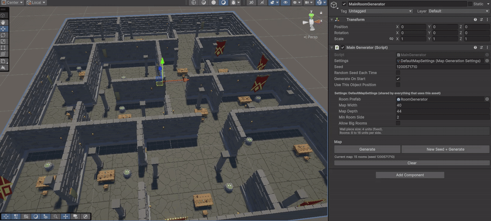
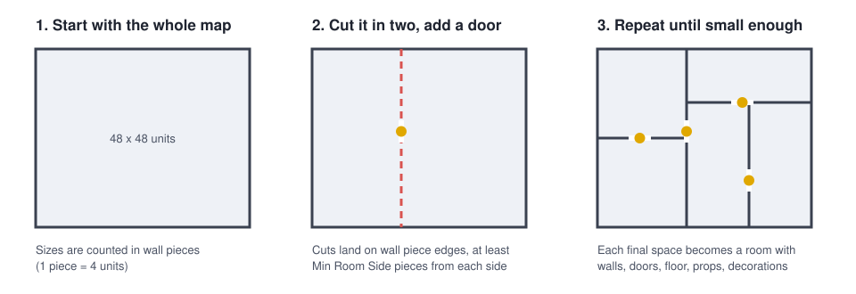
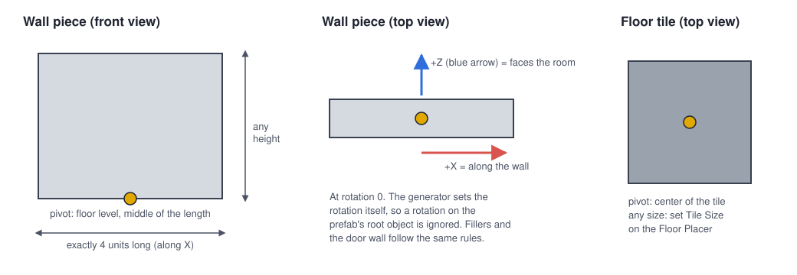

# Rooms Generation Tool

A Unity tool that builds random, connected room layouts (houses, dungeons, offices) using **Binary Space Partitioning (BSP)**. It splits an area into rooms, connects them with doors, then fills each room with walls, floor, furniture and wall decorations from **your own prefabs**.

Same seed = same map, so you can save a layout just by saving a number.



## Features

- **BSP room layout:** the map is cut into rooms of a size you control. Every room can be reached through doors.
- **Generate in the editor or at runtime:** press a button in the Inspector, or call `Generate()` from code.
- **Seeded:** the same seed and settings always give the same map.
- **Your own art:** walls, doors, floor tiles, furniture and wall decorations are all prefabs you choose.
- **Furniture placement:** objects take up real space on a grid, don't overlap, and can keep a distance from objects of the same type.
- **Table decoration:** tables get random objects (books, mugs...) placed on top.
- **Room data for your game code:** get every room's position, size and doors, to place the player, enemies, loot or a goal.
- **Presets:** save map settings as assets and swap them in one click.
- **Grey-box sample included:** works right after install, no art pack needed.

## Install

1. In Unity, open **Window > Package Manager**.
2. Click **+** (top left) > **Add package from git URL...**
3. Paste this and click **Add**:

```
https://github.com/AdamKacem/RoomsGenerationTool.git?path=/Packages/com.adamkacem.roomsgeneration
```

Made with Unity 6 (6000.0). It should work on Unity 2022.3 and newer.

> **Render pipeline:** the sample's grey-box materials use URP (the default in new Unity projects). On the Built-in pipeline they show up pink: select the materials in `Samples/.../Materials` and change their shader to **Standard**.

## Quick start (2 minutes)

1. In the Package Manager, select **Rooms Generation Tool**, open the **Samples** tab and click **Import** next to **Placeholder Demo**.
2. Drag **Map Generator (Placeholder Demo)** from `Assets/Samples/Rooms Generation Tool/.../PlaceholderDemo` into your scene.
3. Select it and click **Generate** in the Inspector. Click **New Seed + Generate** to get a new layout.


### What you get out of the box


This is the **Placeholder Demo**: plain grey blocks, so the tool works right after you install it. The layout, doors and furniture placement are the same as in the GIF above, only the art is different. To get a real look, either:

- **use any art you like:** swap in your own walls, floor and props (see [Using your own assets](#using-your-own-assets)), or
- **get the look from the GIF:** download the free packs listed in [Demo project and credits](#demo-project-and-credits) and assign their prefabs.

To start from scratch instead: **GameObject > Rooms Generation > Map Generator**, then create a preset with **right-click in the Project window > Create > Rooms Generation > Map Settings** and drag it into the generator's **Settings** slot.

## Settings

The generator has two parts:

- **The Map Settings asset (the preset)** decides the **layout**: how big the map is and how big rooms are. It also points to the **room prefab**, which decides the **look**.
- **The Map Generator component** decides **which map** you get: the seed, and when to generate.

You can keep several presets (for example "Small dungeon" and "Big mansion") and switch by dragging a different one into the generator.

### Map Settings (preset)

| Setting | What it does |
|---|---|
| **Room Prefab** | The prefab that builds one room. It holds the wall, door, floor and furniture prefabs (see [Using your own assets](#using-your-own-assets)). |
| **Map Width / Map Depth** | Size of the whole map, in units. Keep them **multiples of 4**. |
| **Min Room Side** | Shortest allowed side of a room, counted in **wall pieces** (1 piece = 4 units), not units. Rooms end up between this and twice this per side. Example: 3 gives rooms of 12 to 24 units per side. |
| **Allow Big Rooms** | If on, some rooms stop splitting early and can end up long and big. |

The Inspector shows the room size you will get and warns you about settings that won't work (for example a map too small to split, which gives one giant room).

### Map Generator (component)

| Setting | What it does |
|---|---|
| **Settings** | The preset to use. |
| **Seed** | Same seed + same settings = same map. |
| **Random Seed Each Time** | Pick a new seed on every generation. |
| **Generate On Start** | Build a new map when the game starts. Turn off to keep a map you built in the editor. |
| **Use This Object Position** | Build the map around this object instead of the world origin. |

Buttons: **Generate**, **New Seed + Generate**, **Clear**. Everything generated goes inside a child object called `Generated Map`, and Ctrl+Z works.

## How it works



1. **Split.** The map is cut in two at a random spot, then each half is cut again, and so on. A space stops being cut when it's too small to give two rooms of at least **Min Room Side**.
2. **Doors.** Every cut gets one door, placed on a random wall piece along the cut. Because every cut connects its two sides, **every room can be reached**.
3. **Build.** Each final space becomes a room. The room prefab places, in order: walls (with doors where needed), furniture, wall decorations, then the floor.

**Why multiples of 4?** Cuts always land on the edge of a wall piece (4 units). If the map is a multiple of 4, every room is too, so walls and floor tiles fit exactly. If not, the leftover units end up in the rooms along the right and top edges, which then need short filler walls and slightly stretched floor tiles. The settings show a warning when that happens.

## Using your own assets

The look of a room comes from the **room prefab** (`PH_Room` in the sample). The easiest way to make your own theme:

1. Right-click `PH_Room` > **Create > Prefab Variant**.
2. In the variant, replace the prefabs on its components (Wall Placer, Floor Placer, Objects Placer, Wall Decorator).
3. Create a Map Settings preset that uses your variant.



**Walls** (Wall Placer: wall, door wall, and the 1, 2 and 3 unit fillers)

- Exactly **4 units long** (fillers: 1, 2 and 3 units). Any height and thickness.
- **Pivot at floor level, in the middle of the length.**
- At rotation 0, the wall runs along **X** and its room side faces **+Z** (the blue arrow).
- The generator sets each wall's rotation itself, so a rotation on the prefab's root object is ignored.
- The fillers are only used when the map size isn't a multiple of 4.

**Floor tile** (Floor Placer)

- Any size: set **Tile Size** on the Floor Placer to match it.
- **Pivot in the center** of the tile.

**Tip for any model:** most models from the Asset Store won't match these rules out of the box. Create an empty object where the pivot should be, put the model inside it as a child, and move, rotate or scale the child until it fits. Save the parent as your prefab.

### Furniture (Placeable assets)

Create one with **Create > Rooms Generation > Placeable (floor object)**. Each room's floor is a grid of 1 x 1 unit cells.

| Field | What it does |
|---|---|
| **Prefab** | The object to place. Pivot at the bottom. |
| **Shape** | The grid cells it takes up, relative to its own cell (0,0). A 2 x 2 object is (0,0), (1,0), (0,1), (1,1). |
| **Type** | A group name. Objects with the same type keep their distance (see Radius). `TableChair` is special: those objects get decorations placed on top. |
| **Can Rotate** | Randomly rotate by 90° steps. |
| **Offset / Y Offset** | Shift the object (in cells / in units), for example to center a 2 x 2 object. |
| **Radius For Same Object** | No other object of the same type within this many cells. |

Table decorations use the same asset type, on a finer grid (0.15 units per cell) on top of the table.

### Wall decorations (Wall Placeable assets)

Create one with **Create > Rooms Generation > Wall Placeable (wall decoration)**. The pivot goes on the wall surface and the object sticks out toward +Z. Every wall gets one torch, then a few random decorations are added.

| Field | What it does |
|---|---|
| **Padding** | Free space kept on each side of it along the wall. |
| **Offset** | Shift along the wall. |
| **Y Offset** | Raises the lowest height it can be placed at (height is random between 2.7 and 3.7 units). |

## Using the room data in your code

After generating, `MainGenerator.Rooms` lists every room with its position, size and doors. Use it to place the player, enemies, loot or an exit.

```csharp
using AdamKacem.RoomsGeneration;
using UnityEngine;

public class SpawnPlayer : MonoBehaviour
{
    public MainGenerator generator;
    public Transform player;
    public GameObject exitPrefab;

    void Start()
    {
        // Turn off "Generate On Start" on the generator when you call Generate() yourself.
        generator.Generate();

        RoomInfo start = generator.Rooms[0];
        RoomInfo exit = generator.GetFarthestRoomFrom(start);

        player.position = start.center + Vector3.up;
        Instantiate(exitPrefab, exit.center, Quaternion.identity);
    }
}
```

What each room gives you:

| Member | Meaning |
|---|---|
| `center` | World position of the room's center, at floor level |
| `size` | Width and depth in units, walls included |
| `Bounds`, `Area` | The room's area |
| `doorTop`, `doorBottom`, `doorLeft`, `doorRight` | Which wall piece is a door on each side (-1 = no door) |
| `DoorCount`, `GetDoorPositions()` | Number of doors, and the world position of each doorway |
| `Contains(point)` | Is this point inside the room? |
| `gameObject` | The room's object (walls, props and floor are its children) |

The generator also has `GetRoomAt(position)`, `GetFarthestRoomFrom(room)` and an `OnGenerated` event. The sample's `StartAndEndMarkers` script shows them in action: it marks the first room, the farthest room and every doorway.

## Known limitations

- Wall pieces must be 4 units long. Other sizes would need changes to the wall and door logic.
- Each room places a fixed set of furniture: one table with chairs, two pillars and one pot (if they fit). Choosing what and how many to place per room is planned.
- The table-decoration grid is tuned to the size of the sample table.
- Neighboring rooms each build their own wall on the line they share, so shared walls are doubled.
- "Keep Away From Corners" on Placeables is not implemented yet.

## Repository layout

```
Packages/com.adamkacem.roomsgeneration/   <- the tool (this is what gets installed)
    Runtime/                               generator, BSP, placers, room data
    Editor/                                Inspector buttons, warnings, menu items
    Samples~/PlaceholderDemo/              grey-box assets, presets, example script
Assets/                                    my demo project (uses the art packs below)
Docs/images/                               pictures for this README
```

## Demo project and credits

The screenshots and GIFs use these free Asset Store packs. **They are not included in this repository** (their license doesn't allow sharing the files). To open the full demo project with the same look, download them from the Asset Store and import them into the project:

- [Low Poly Dungeons Lite](https://assetstore.unity.com/packages/3d/environments/dungeons/low-poly-dungeons-lite-177937) by JustCreate: walls, chairs, columns, pots, torches
- [Low Poly Dungeon Pack](https://assetstore.unity.com/packages/3d/environments/dungeons/low-poly-dungeon-pack-63018) by Broken Vector: floor tiles, banners, mugs, goblets, drinking horns

The tool itself and the grey-box sample work without them.

## License

[MIT](Packages/com.adamkacem.roomsgeneration/LICENSE.md): free to use in personal and commercial projects.
